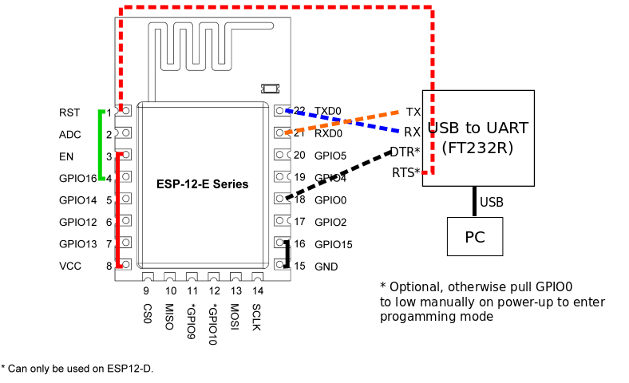

Manual upload
------

1. Connect as shown in esp-12-programming-wire-up.png (solid lines). Red and black are necessary to boot, green is optional and only needed to wake up from deep sleep.
2. Connect VCC and GND to a 3.3V power source. Cannot be USB powered reliably because the ESP uses 500ma at peaks. 
3. Connect the dotted lines to the programmer and run monitor.sh script (or platformio monitor if using IDE)
4. Power up the ESP, press both reset and program buttons and release the reset button first. If you did it correctly, you should see the following on the serial monitor:

rl␀l��|␀�l�|␂␌␌␌�␌l�␌b|��␂�␒�r�b�␌b��nn�lnn���␌bpp��lrlrl

5. Run ./prod-upload-firmware.sh or upload through IDE

Over the air (OTA) update
------

1. !!! Make sure the device has been reset manually at least once since manual upload, otherwise it bricks and needs another manual upload to function. 
2. Use the ./prod-to-website.sh script to put the version (defined in the head of src/EspIdiot.ino) to the otselo.eu website. 
3. Set desired to {..., "version":"<new_version>"} replacing new_version with the actual verison (such as "z10")
4. Next time device goes through loop it will pick up the new version and auto-update. Normally that takes around a minute.

